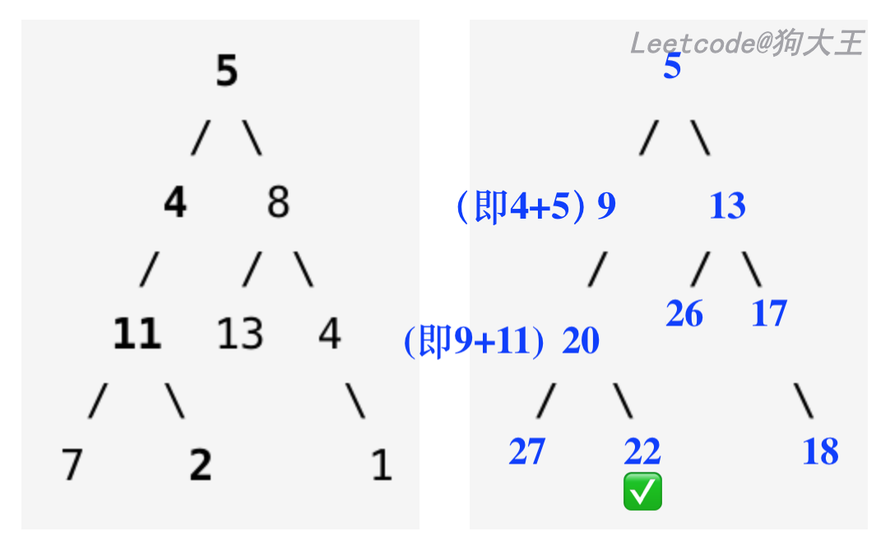

# 112.路径总和

| Title | Describe                                                    |
| :---- | :---------------------------------------------------------- |
| 题目  | [112. 路径总和](https://leetcode-cn.com/problems/path-sum/) |
| 难度  | ⭐                                                          |

给定一个二叉树和一个目标和，判断该树中是否存在根节点到叶子节点的路径，这条路径上所有节点值相加等于目标和。

说明:  叶子节点是指没有子节点的节点。

示例: 
给定如下二叉树，以及目标和 sum = 22，

              5
             / \
            4   8
           /   / \
          11  13  4
         /  \      \
        7    2      1

返回 true, 因为存在目标和为 22 的根节点到叶子节点的路径 5->4->11->2。

## 思路

### 递归

二叉树有关的题最先想到的解法就是递归，这里适用深度优先搜索。

### 迭代

迭代是二叉树除递归外的另一种实现，遍历方法仍是深度优先搜索。

### 回溯算法

暂未接触，待补上。

### 动态规划

刚好昨天刷了`718.最长重复子数组`这道题目，顺带补了下动态规划这块的内容。

动态规划解决问题的过程分为两步：

- 寻找**状态转移方程**

- 利用状态转移方程式**自底向上**求解问题

在这里温习一下昨天学习的经典例子:

#### 爬楼梯（leetcode 第 70 题）

还未记录，下次补上。

**题目**

假设你正在爬楼梯。需要 n 阶你才能到达楼顶。

每次你可以爬 1 或 2 个台阶。你有多少种不同的方法可以爬到楼顶呢？

注意：给定 n 是一个正整数。

**思路**

设置一个函数 F(N)，表示走到第 N 级台阶走法的数量。

现在假设有 10 级台阶。现在就会出现两种情况：

- 我们是从第 9 级，跨 1 级上来，到第 10 级

- 我们是从第 8 级，跨 2 级上来，到第 10 级

其实对于任何第 N 级台阶，都会出现这两种情况，即第 N 级的前一步是走了 1 级或者两级。

也即：`F(10) = F(9) + F(8)、F(9) = F(8) + F(7)......`

找找规律，其实 `F(N) = F(N-1) + F(N-2)`就是前面说的第一步中的**状态转移方程**。

一直到最底层，当只有 1 级台阶时，F(1) = 1;当只有 2 级台阶时 F(2) = 2.

```javascript
function climbStairs(n) {
  let step = [1, 2];
  for (let i = 2; i < n; i++) {
    step.push(step[i - 1] + arr[i - 2]);
  }
  return step[n - 1];
}
```

## 题解

### 方法一：递归（动态规划）

这里其实是用到动态规划的思想。

一层一层把值加起来，到时候只看底部是否有叶子节点能和 sum 值相等即可

在 leetcode 的题解上看到的 👇



[又能 DP: 在原二叉树上进行修改的思路; 附 Python 代码](https://leetcode-cn.com/problems/path-sum/solution/you-neng-dp-zai-yuan-er-cha-shu-shang-jin-xing-xiu/)

```javascript
/**
 * Definition for a binary tree node.
 * function TreeNode(val) {
 *     this.val = val;
 *     this.left = this.right = null;
 * }
 */
/**
 * @param {TreeNode} root
 * @param {number} sum
 * @return {boolean}
 */
var hasPathSum = function(root, sum) {
  //如果不存在，表示不是叶子节点
  if (!root) return false;
  //如果是叶子节点，判断减去这个节点的值是否为0
  if (!root.left && !root.right) return sum - root.val === 0;
  //左右节点递归寻找一条存在的pathSum
  return (
    hasPathSum(root.left, sum - root.val) ||
    hasPathSum(root.right, sum - root.val)
  );
};
```

### 方法二：迭代

参考递归的版本，只不过实现方式不一样，都是深度优先搜索。

```javascript
/**
 * Definition for a binary tree node.
 * function TreeNode(val) {
 *     this.val = val;
 *     this.left = this.right = null;
 * }
 */
/**
 * @param {TreeNode} root
 * @param {number} sum
 * @return {boolean}
 */
var hasPathSum = function(root, sum) {
  if (root === null) return false;
  let stack = [root];
  let sumStack = [sum - root.val];
  while (stack.length > 0) {
    let node = stack.pop();
    let curSum = sumStack.pop();
    if (node.left === null && node.right === null && curSum === 0) {
      return true;
    }
    if (node.right !== null) {
      stack.push(node.right);
      sumStack.push(curSum - node.right.val);
    }
    if (node.left !== null) {
      stack.push(node.left);
      sumStack.push(curSum - node.left.val);
    }
  }
  return false;
};
```
