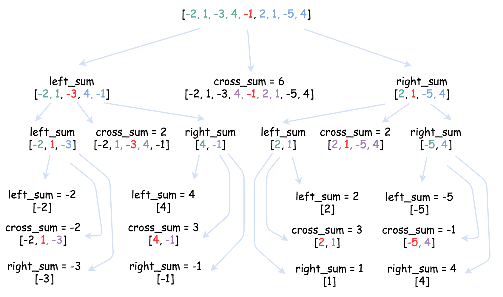

# 53.最大子序和

| Title | Describe |
| :---- | :---- |
| 题目  | [53.最大子序和](https://leetcode-cn.com/problems/maximum-subarray/) |
| 难度  | ⭐ |

## 题目

给定一个整数数组 nums ，找到一个具有最大和的连续子数组（子数组最少包含一个元素），返回其最大和。

示例:

```
输入: [-2,1,-3,4,-1,2,1,-5,4],
输出: 6
解释: 连续子数组 [4,-1,2,1] 的和最大，为 6。
```

进阶:

如果你已经实现复杂度为 O(n) 的解法，尝试使用更为精妙的分治法求解。

## 题解

### 方法一：动态规划

dp[i]为数组从起始到索引i时的最大连续子数组的最大和

```
dp[i] = Math.max(dp[i - 1] + nums[i], nums[i]);
```

#### 代码
```javascript
/**
 * @param {number[]} nums
 * @return {number}
 */
var maxSubArray = function(nums) {
    if (nums.length === 1) return nums[0];
    let result = nums[0];
    let n = nums.length;
    let  dp = [];
    dp[0] = nums[0];
    result = dp[0];
    for (let i = 1; i < n; i++) {
        dp[i] = Math.max(dp[i - 1] + nums[i], nums[i]);
        result = Math.max(result, dp[i]);
    }
    return result;
};
```

### 方法二：分治法

>Wiki：在计算机科学中，分治法是建基于多项分支递归的一种很重要的算法范式。字面上的解释是“分而治之”，就是把一个复杂的问题分成两个或更多的相同或相似的子问题，直到最后子问题可以简单的直接求解，原问题的解即子问题的解的合并。

参考下图（来自leetcode-cn官方题解）



[官方题解-分治](https://leetcode-cn.com/problems/maximum-subarray/solution/zui-da-zi-xu-he-by-leetcode-solution/)

#### 代码
```javascript
function Status(l, r, m, i) {
    this.lSum = l;
    this.rSum = r;
    this.mSum = m;
    this.iSum = i;
}

const pushUp = (l, r) => {
    const iSum = l.iSum + r.iSum;
    const lSum = Math.max(l.lSum, l.iSum + r.lSum);
    const rSum = Math.max(r.rSum, r.iSum + l.rSum);
    const mSum = Math.max(Math.max(l.mSum, r.mSum), l.rSum + r.lSum);
    return new Status(lSum, rSum, mSum, iSum);
}

const getInfo = (a, l, r) => {
    if (l === r) return new Status(a[l], a[l], a[l], a[l]);
    const m = (l + r) >> 1;
    const lSub = getInfo(a, l, m);
    const rSub = getInfo(a, m + 1, r);
    return pushUp(lSub, rSub);
}

/**
 * @param {number[]} nums
 * @return {number}
 */
var maxSubArray = function(nums) {
    return getInfo(nums, 0, nums.length - 1).mSum;
};
```
