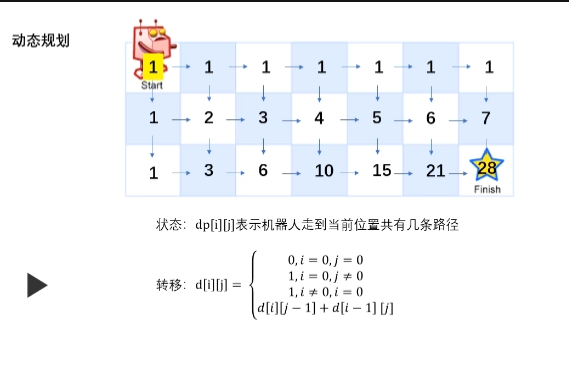

# 62.不同路径

| Title | Describe                                                      |
| :---- | :------------------------------------------------------------ |
| 题目  | [62.不同路径](https://leetcode-cn.com/problems/unique-paths/) |
| 难度  | ⭐⭐                                                          |

## 题目

一个机器人位于一个 m x n 网格的左上角 （起始点在下图中标记为“Start” ）。

机器人每次只能向下或者向右移动一步。机器人试图达到网格的右下角（在下图中标记为“Finish”）。

问总共有多少条不同的路径？


例如，上图是一个 7 x 3 的网格。有多少可能的路径？

示例  1:

```
输入: m = 3, n = 2
输出: 3
解释:
从左上角开始，总共有 3 条路径可以到达右下角。
1. 向右 -> 向右 -> 向下
2. 向右 -> 向下 -> 向右
3. 向下 -> 向右 -> 向右
```

示例  2:

```
输入: m = 7, n = 3
输出: 28
```

提示：

- 1 <= m, n <= 100
- 题目数据保证答案小于等于 2 \* 10 ^ 9

## 题解

### 方法一：排列组合

先分析题目，因为机器人每次只能往下或者往右一步，那么意味着，机器人从起点到终点，必定是需要往右移动 m-1 步，向下移动 n-1 步,总共走 m+n-2 步。接下来，我们要在 m+n-2 中选择 m-1 向下走的，那么剩余的就是向右走的步数。

组合数：

$ C_{m+n-2}^{m-1} $ 或$ C_{m+n-2}^{n-1}  $

组合数公式:

$ C_n^m = \frac{n!}{m!(n-m)!} = C_n^{n-m}$

那么$ C_{m+n-2}^{m-1}= \frac{(m+n-2)!}{(m-1)!(n-1))!} $

```javascript
/**
 * @param {number} m
 * @param {number} n
 * @return {number}
 */
var uniquePaths = function(m, n) {
  return factorial(m + n - 2) / factorial(m - 1) / factorial(n - 1);
};

// 阶乘
function factorial(num) {
  if (num <= 1) return 1;
  return num * factorial(num - 1);
}
```

### 方法二：动态规划

思路：

- 将其走法放入一个二位数组中 dp[i][j]，i 代表第几行，j 代表第几列

- j为0，意味着当前只能往下边走，dp[i][0] = 1

- i为0，意味着当前只能往右边走，dp[0][j] = 1

- 其他情况，dp[i][j] = dp[i-1][j] + dp[i][j-1];


可以看到下图，是 7x3 的网格，图中把走到每个网格的走法都写出来了。



图来自[Vin](https://leetcode-cn.com/problems/unique-paths/solution/tu-jie-bu-tong-lu-jing-shu-c-by-vin-18/)

按照**自顶向上**我们可以 7x3 把网格一一分解成更小的网格去分析。
首先 1x1=>1,2x1=>1..6x1=>1,7x1=>1,m 列 1 行的走法是 mx1=m 种走法，
其次 1x2=>1,2x2=>2..6x2=>6,7x2=>7,
最后 1x3=>1,2x3=>3..6x3=>21,7x3=>28

我们将其走法放入一个二位数组中 dp[i][j],i 代表第几行，j 代表第几列

```
[
    [ 1, 1, 1,  1,  1,  1,  1],
    [ 1, 2, 3,  4,  5,  6,  7],
    [ 1, 3, 6, 10, 15, 21, 28],
]
```

可以发现，其实从第二行开始，每列`dp[i][j]`的走法 都是前列`dp[i][j-1]`加上前行`dp[i-1][j]`的和,即 `dp[i][j]=dp[i][j-1]+dp[i-1][j]`;

- 写法一

```javascript
/**
 * @param {number} m
 * @param {number} n
 * @return {number}
 */
var uniquePaths = function(m, n) {
  // 将边界情况都填满为1
  var arr = new Array(m).fill().map(() => new Array(n).fill(1));

  for (var i = 1; i < m; i++) {
    for (j = 1; j < n; j++) {
      arr[i][j] = arr[i - 1][j] + arr[i][j - 1];
    }
  }
  return arr[m - 1][n - 1];
};
```

- 写法二

```javascript
/**
 * @param {number} m
 * @param {number} n
 * @return {number}
 */
var uniquePaths = function(m, n) {
    var dp = [];
    for(let i=0;i<m;i++){
        dp[i] = [];
        for(let j=0;j<n;j++){
            if(j==0||i==0){
                dp[i][j] = 1;
            }else{
                dp[i][j] = dp[i-1][j] + dp[i][j-1];
            }
        }
    }
    return dp[m - 1][n - 1];
};
```
