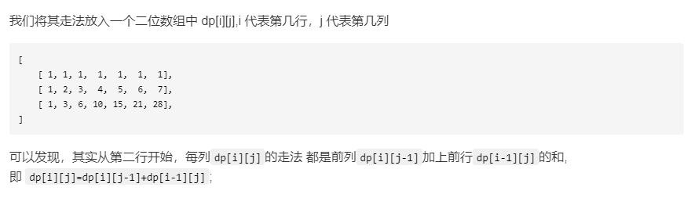
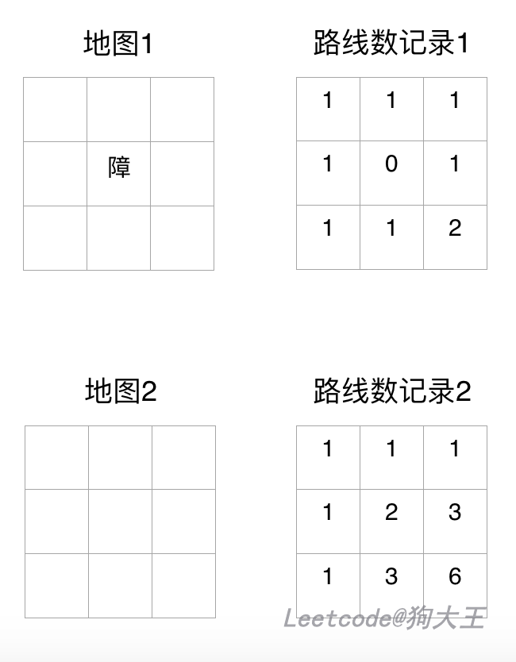

# 63.不同路径 II

| Title | Describe                                                            |
| :---- | :------------------------------------------------------------------ |
| 题目  | [63.不同路径 II](https://leetcode-cn.com/problems/unique-paths-ii/) |
| 难度  | ⭐⭐                                                                |

## 题目

一个机器人位于一个 m x n 网格的左上角 （起始点在下图中标记为“Start” ）。

机器人每次只能向下或者向右移动一步。机器人试图达到网格的右下角（在下图中标记为“Finish”）。

现在考虑网格中有障碍物。那么从左上角到右下角将会有多少条不同的路径？


网格中的障碍物和空位置分别用 1 和 0 来表示。

说明：m 和 n 的值均不超过 100。

示例  1:

```
输入:
[
  [0,0,0],
  [0,1,0],
  [0,0,0]
]
输出: 2
解释:
3x3 网格的正中间有一个障碍物。
从左上角到右下角一共有 2 条不同的路径：
1. 向右 -> 向右 -> 向下 -> 向下
2. 向下 -> 向下 -> 向右 -> 向右
```

## 题解

### 解法一：动态规划

这道题与`62.不同路径`区别就是多了障碍物。我们先看下之前的解法：



那我们只要在这道题中，将有障碍物的点 dp[i][j]的值记为 0 就 ok 了。

如下图，图来自[狗大王](https://leetcode-cn.com/problems/unique-paths-ii/solution/jian-ji-biao-ge-jie-shi-dong-tai-gui-hua-dpsi-lu-f/)，请叫我“盗图”小能手！

地图 1 是有障碍的，地图 2 是没有障碍的。



- 写法一

```javascript
/**
 * @param {number[][]} obstacleGrid
 * @return {number}
 */
var uniquePathsWithObstacles = function(obstacleGrid) {
  let { length: height } = obstacleGrid;
  let { length: width } = obstacleGrid[0];
  for (let m = 0; m < height; m++) {
    for (let n = 0; n < width; n++) {
      if (obstacleGrid[m][n]) {
        obstacleGrid[m][n] = 0;
      } else {
        if (m == 0 && n == 0) {
          obstacleGrid[m][n] = 1;
        } else {
          if (m != 0) {
            a = obstacleGrid[m - 1][n];
          } else {
            a = 0;
          }

          if (n != 0) {
            b = obstacleGrid[m][n - 1];
          } else {
            b = 0;
          }

          obstacleGrid[m][n] = a + b;
        }
      }
    }
  }
  return obstacleGrid[height - 1][width - 1];
};
```

- 写法二

```javascript
/**
 * @param {number[][]} obstacleGrid
 * @return {number}
 */
var uniquePathsWithObstacles = function(obstacleGrid) {
    var m = obstacleGrid.length;
    var n = obstacleGrid[0].length;
    var dp = [];
    for(let i=0;i<m;i++){
        dp[i] = [];
        for(let j=0;j<n;j++){
            if(obstacleGrid[i][j]==1){
                dp[i][j] = 0;
            }else {
                if(i==0 && j==0){
                  dp[i][j] = 1;
                }else{
                    var total = 0;
                    if(i!=0&&obstacleGrid[i-1][j]==0){
                        total+=dp[i-1][j];
                    }
                    if(j!=0&&obstacleGrid[i][j-1]==0){
                        total+=dp[i][j-1];
                    }
                    dp[i][j] = total;
                }
            }
        }
    }
    return dp[m - 1][n - 1];
};
```
