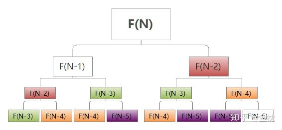

# 70.爬楼梯

| Title | Describe                                                        |
| :---- | :-------------------------------------------------------------- |
| 题目  | [70. 爬楼梯](https://leetcode-cn.com/problems/climbing-stairs/) |
| 难度  | ⭐                                                              |

## 题目

假设你正在爬楼梯。需要 n  阶你才能到达楼顶。

每次你可以爬 1 或 2 个台阶。你有多少种不同的方法可以爬到楼顶呢？

注意：给定 n 是一个正整数。

示例 1：

```
输入： 2
输出： 2
解释： 有两种方法可以爬到楼顶。
1.  1 阶 + 1 阶
2.  2 阶
```

示例 2：

```
输入： 3
输出： 3
解释： 有三种方法可以爬到楼顶。
1.  1 阶 + 1 阶 + 1 阶
2.  1 阶 + 2 阶
3.  2 阶 + 1 阶
```

推荐看看程序员小灰的漫画讲解[《漫画：什么是动态规划》](https://mp.weixin.qq.com/s/3h9iqU4rdH3EIy5m6AzXsg)

## 思路

设置一个函数 F(N)，表示走到第 N 级台阶走法的数量。

现在假设有 10 级台阶。现在就会出现两种情况：

1. 我们是从第 9 级，跨 1 级上来，到第 10 级

2. 我们是从第 8 级，跨 2 级上来，到第 10 级

其实对于任何第 N 级台阶，都会出现这两种情况，即第 N 级的前一步是走了 1 级或者两级。

`F(10) = F(9) + F(8)`、`F(9) = F(8) + F(7)`......`F(3) = F(2) + F(1)`

- **递归**

递归的话需要满足**基线条件**和**递归条件**。

基线条件在这里便是 `F(1) = 1; F(2) = 2`

而递归的话即：`F(n) = F(n - 1) + F(n - 2)`

递归法的问题即是时间复杂度比较高，会有大量重复过程。参考如下图（图来自[鱼枕](https://zhuanlan.zhihu.com/p/49427827)）



而恰恰动态规划能够解决这个问题，请看 👇

- **动态规划**

动态规划解决问题的过程分为两步：

1. 寻找**状态转移方程**

2. 利用状态转移方程式**自底向上**求解问题

找找规律，其实 `F(N) = F(N-1) + F(N-2)`就是前面说的第一步中的**状态转移方程**。

一直到最底层，当只有 1 级台阶时，F(1) = 1;当只有 2 级台阶时 F(2) = 2.

刚才递归是从 10 级台阶往下，计算 F(9)和 F(8)，再计算 F(9)需要的 F(8)和 F(7)，以此类推。

转换思路，采用自底向下构造，也即动态规划过程的第二部，采用**自底向上**的方法求解问题。

从 3 级（1、2 级已知）台阶往上计算 F(3)， F(3)需要 计算 F(2) 和 F(1)，计算 F(4)需要 F(3)和 F(2)，以此类推。

- **矩阵快速幂**

// TODO:待补充

- **通项公式**

// TODO:待补充

**矩阵快速幂**和**通项公式**是来自[官方题解](https://leetcode-cn.com/problems/climbing-stairs/solution/pa-lou-ti-by-leetcode-solution/)的方法，暂未研究，待补充

## 相似

[746. 使用最小花费爬楼梯](https://leetcode-cn.com/problems/min-cost-climbing-stairs/)

## 题解

### 方法一：递归

- 写法一

```javascript
function climbStairs(n) {
  if (n === 1) return 1;
  if (n === 2) return 2;
  return climbStairs(n - 1) + climbStairs(n - 2);
}
```

- 写法二

尾递归优化

```javascript
function climbStairs(n ,a = 1, b = 1){
  if (n <= 1) return b;
    return climbStairs(n - 1, b, a + b);
}
```

### 方法二：动态规划

- 写法一

```javascript
function climbStairs(n) {
  let step = [1, 2];
  for (let i = 2; i < n; i++) {
    step[i] = step[i - 1] + step[i - 2];
  }
  return step[n - 1];
}
```

- 写法二

压缩空间，优化

```javascript
function climbStairs(n) {
  let prev = 1;
  let cur = 1;
  for (let i = 2; i < n + 1; i++) {
    // const temp = cur;   // 暂存上一次的cur
    // cur = prev + cur;   // 当前的cur = 上上次cur + 上一次cur
    // prev = temp;        // prev 更新为 上一次的cur
    [cur, prev] = [prev + cur,cur]
  }
  return cur;
}
```

### 方法三：矩阵快速幂

```javascript
// TODO: 待补充
```

### 方法四：通项公式

```javascript
// TODO: 待补充
```
