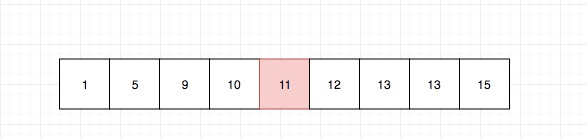
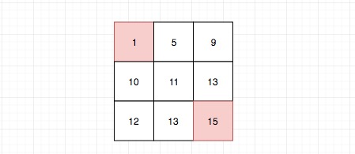
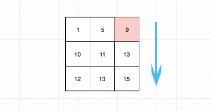

# 378.有序矩阵中第 K 小的元素

| Title | Describe                                                                                                 |
| :---- | :------------------------------------------------------------------------------------------------------- |
| 题目  | [378.有序矩阵中第 K 小的元素](https://leetcode-cn.com/problems/kth-smallest-element-in-a-sorted-matrix/) |
| 难度  | ⭐⭐                                                                                                     |

## 题目

给定一个  n x n  矩阵，其中每行和每列元素均按升序排序，找到矩阵中第 k 小的元素。

请注意，它是排序后的第 k 小元素，而不是第 k 个不同的元素。

示例：

```
matrix = [
   [ 1,  5,  9],
   [10, 11, 13],
   [12, 13, 15]
];
k = 8;
返回 13。
```

提示：你可以假设 k 的值永远是有效的，1 ≤ k ≤ n2 。

## 题解

### 方法一：直接排序

将数组拍平，并对拍平后的数组进行排序，最后一维数组中的第 k 个数就是需要返回的值。

#### 代码

js 利用数组`flat()`以及`sort()`方法，一行代码搞定

```javascript
var kthSmallest = function(matrix, k) {
  return matrix.flat().sort((a, b) => a - b)[k - 1];
};
```

复杂度分析

- 时间复杂度：$O(n^2\log{n})$，对$n^2$个数排序。

- 空间复杂度：$O(n^2)$，一维数组需要存储这 $n^2$个数。

### 方法二：二分查找

二分查找就是不断拿取中间值，然后重新确认边界,知道找到值。

但在这里，我们拿的中间值不是常规的二分法的中间值。



我们知道，矩阵左上角元素`matrix[0][0]`是下限,右下角元素`matrix[n-1][n-1]`是上限，第 k 小的元素在这个区间范围内。

我们要拿的中间值如下图所示：



抓住**每行和每列元素均按升序排序**这一特性，可以拿这个值去计算有多少元素是小于等于它的。

具体方式就是比较行的最后一列，如果中间值比最后一列大，说明中间元素肯定大于这一行的所有元素。 否

则我们从后往前遍历直到不大于。



以上图皆来自自[lucifer](https://leetcode-cn.com/problems/kth-smallest-element-in-a-sorted-matrix/solution/er-fen-cha-zhao-378-you-xu-ju-zhen-zhong-di-kxiao-/)

#### 代码

```javascript
var kthSmallest = function(matrix, k) {
  const countInMatrix = (matrix, midVal) => {
    const n = matrix.length; // 这题是方阵 n行n列
    let count = 0;
    let row = 0; // 第一行
    let col = n - 1; // 最后一列
    while (row < n && col >= 0) {
      if (midVal >= matrix[row][col]) {
        // 大于等于当前行的最右
        count += col + 1; // 不大于它的数增加col + 1个
        row++; // 比较下一行
      } else {
        // 干不过当前行的最右元素
        col--; // 留在当前行，比较左边一个
      }
    }
    return count;
  };

  const kthSmallest = (matrix, k) => {
    const n = matrix.length;
    let low = matrix[0][0];
    let high = matrix[n - 1][n - 1];
    while (low <= high) {
      let midVal = low + ((high - low) >>> 1); // 获取中间值
      let count = countInMatrix(matrix, midVal); // 矩阵中小于等于它的个数
      if (count < k) {
        low = midVal + 1;
      } else {
        high = midVal - 1;
      }
    }
    return low;
  };
};
```

### 方法三：归并查找

```javascript
// TODO:待补充
```
