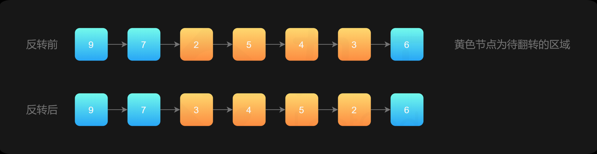

# 92.反转链表 II

| Title | Describe                                                                   |
| :---- | :------------------------------------------------------------------------- |
| 题目  | [92.反转链表 II](https://leetcode-cn.com/problems/reverse-linked-list-ii/) |
| 难度  | ⭐⭐                                                                       |

## 题目

反转从位置 m 到 n 的链表。请使用一趟扫描完成反转。

说明:
1 ≤ m ≤ n ≤ 链表长度。

示例:

```
输入: 1->2->3->4->5->NULL, m = 2, n = 4
输出: 1->4->3->2->5->NULL
```

## 题解




### 方法一：穿针引线


1. 先反转需要反转的链表，得到反转后的链表。
2. 将 `pre` 的 `next` 指针指向**反转后的链表的头节点** ，**将反转后的链表的尾节点**的 `next` 指针指向 `succ`。


```javascript
var reverseBetween = function(head, left, right) {
    const dummyNode = new ListNode(-1);
    dummyNode.next = head;//虚拟头节点

    let pre = dummyNode;
    for (let i = 0; i < left - 1; i++) { //pre遍历到left的前一个节点
        pre = pre.next;
    }
    // pre 2 3 4 5 6 7 8
    let rightNode = pre;  // 2 3 4 5 6 7 8
    for (let i = 0; i < right - left + 1; i++) { //rightNode遍历到right的位置
        rightNode = rightNode.next;
    }
    // rightNode 6 7 8
    let leftNode = pre.next; //保存leftNode // 3 4 5 6 7 8
    let curr = rightNode.next; //保存rightNode.next // 7 8

  	// 切断left到right的子链
    pre.next = null; // pre 2 null
    rightNode.next = null; // rightNode 6 null

		// 206题的逻辑 反转left到right的子链
    reverseLinkedList(leftNode);
    // leftNode: 6 5 4 3

    // 返乡连接
    pre.next = rightNode; // 2 6 5 4 3
    leftNode.next = curr; //  6 5 4 3 7 8
    return dummyNode.next;
};

const reverseLinkedList = (head) => {
    let pre = null;
    let cur = head;

    while (cur) {
        const next = cur.next;
        cur.next = pre;
        pre = cur;
        cur = next;
    }
}
```
```javascript 
var reverseBetween = function(head, left, right) {
    // 因为头节点有可能发生变化，使用虚拟头节点可以避免复杂的分类讨论
    const dummyNode = new ListNode(-1);
    dummyNode.next = head;

    let pre = dummyNode;
    // 第 1 步：从虚拟头节点走 left - 1 步，来到 left 节点的前一个节点
    // 建议写在 for 循环里，语义清晰
    for (let i = 0; i < left - 1; i++) {
        pre = pre.next;
    }

    // 第 2 步：从 pre 再走 right - left + 1 步，来到 right 节点
    let rightNode = pre;
    for (let i = 0; i < right - left + 1; i++) {
        rightNode = rightNode.next;
    }

    // 第 3 步：切断出一个子链表（截取链表）
    let leftNode = pre.next;
    let curr = rightNode.next;

    // 注意：切断链接
    pre.next = null;
    rightNode.next = null;

    // 第 4 步：同第 206 题，反转链表的子区间
    reverseLinkedList(leftNode);

    // 第 5 步：接回到原来的链表中
    pre.next = rightNode;
    leftNode.next = curr;
    return dummyNode.next;
};

const reverseLinkedList = (head) => {
    let pre = null;
    let cur = head;

    while (cur) {
        const next = cur.next;
        cur.next = pre;
        pre = cur;
        cur = next;
    }
}
```

### 方法二：一次遍历「穿针引线」反转链表（头插法）

整体思想是：在需要反转的区间里，每遍历到一个节点，让这个新节点来到反转部分的起始位置。下面的图展示了整个流程。


下面我们具体解释如何实现。使用三个指针变量 pre、curr、next 来记录反转的过程中需要的变量，它们的意义如下：

- curr：指向待反转区域的第一个节点 left；
- next：永远指向 curr 的下一个节点，循环过程中，curr 变化以后 next 会变化；
- pre：永远指向待反转区域的第一个节点 left 的前一个节点，在循环过程中不变。

第 1 步，我们使用 ①、②、③ 标注「穿针引线」的步骤。


操作步骤：

- 先将 curr 的下一个节点记录为 next；
- 执行操作①：把 curr 的下一个节点指向 next 的下一个节点；
- 执行操作②：把 next 的下一个节点指向 pre 的下一个节点；
- 执行操作③：把 pre 的下一个节点指向 next。
  
第 1 步完成以后「拉直」的效果如下：


第 2 步，同理。同样需要注意 「穿针引线」操作的先后顺序。


第 2 步完成以后「拉直」的效果如下：


第 3 步，同理。


第 3 步完成以后「拉直」的效果如下：


```javascript
var reverseBetween = function(head, left, right) {
    // 设置 dummyNode 是这一类问题的一般做法
    const dummyNode = new ListNode(-1);
    dummyNode.next = head;
    let pre = dummyNode;
    for (let i = 0; i < left - 1; ++i) {
        pre = pre.next;
    }

    let cur = pre.next;
    for (let i = 0; i < right - left; ++i) {
        const next = cur.next;
        cur.next = next.next;
        next.next = pre.next;
        pre.next = next;
    }
    return dummyNode.next;
};
```