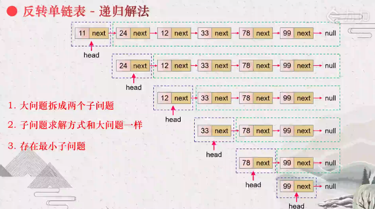
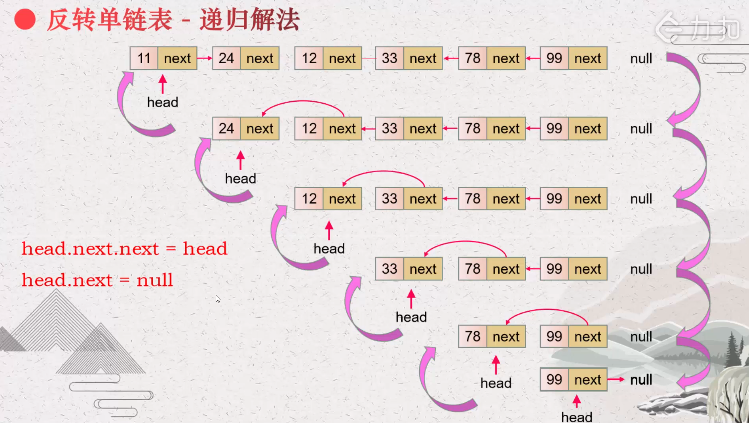

# 206. 反转链表

| Title | Describe                                                               |
| :---- | :--------------------------------------------------------------------- |
| 题目  | [206. 反转链表](https://leetcode-cn.com/problems/reverse-linked-list/) |
| 难度  | ⭐                                                                     |

## 题目

给你单链表的头节点 head ，请你反转链表，并返回反转后的链表。

示例 1：

```
1->2->3->4->5->NULL
        ↓
5->4->3->2->1->NULL
```

```
输入：head = [1,2,3,4,5]
输出：[5,4,3,2,1]
```

示例 2：

```
1->2->NULL
    ↓
2->1->NULL
```

```
输入：head = [1,2]
输出：[2,1]
```

示例 3：

```
输入：head = []
输出：[]
```

## 题解

### 方法一 迭代 

#### 1. 将当前遍历的节点（currNode）挪到链表的尾部位置

根据链表的特性，我们可以在每次遍历节点的时候，**将当前遍历的节点（currNode）挪到链表的尾部位置**，这样在遍历完成后，位于链表尾部的节点也就变成了头节点。这样，链表就反转成功了。


```
round 1:
[1]->2->3->4->5->NULL
[1]->NULL

round 2:
1->[2]->3->4->5->NULL
[2]->1->NULL

round 3:
1->2->[3]->4->5->NULL
[3]->2->1->NULL

round 4:
1->2->3->[4]->5->NULL
[4]->3->2->1->5->NULL

round 5:
1->2->3->4->[5]->NULL
[5]->4->3->2->1->NULL
```

```javascript
/**
 * Definition for singly-linked list.
 * function ListNode(val) {
 *     this.val = val;
 *     this.next = null;
 * }
 */
/**
 * @param {ListNode} head
 * @return {ListNode}
 */
var reverseList = function(head) {
  let prev = null;
  let curr = head; // 推进指针，开始时指向头结点。
  while (curr) {  // curr = 1->2->3->4->5->NULL; // curr = 2->3->4->5->NULL 
    let next = curr.next; // next = 2->3->4->5->NULL; // next = 3->4->5->NULL;
    curr.next = prev; // curr = 1->NULL; // curr = 2->1->NULL
    prev = curr; // prev = 1->NULL; // prev = 2->1->NULL
    curr = next; // curr = 2->3->4->5->NULL;  // curr =  3->4->5->NULL;
  }
  return prev;
};
```

#### 2. 将当前遍历的节点（currNode）的下一个节点（currNode.next）挪到链表的头部位置

根据链表的特性，我们可以在每次遍历节点的时候，**将当前遍历的节点（currNode）的下一个节点（currNode.next）挪到链表的头部位置**，这样在遍历完成后，位于链表尾部的节点也就变成了头节点。这样，链表就反转成功了。

```
round 1:
1->[2]->3->4->5->NULL
[2]->1->3->4->5->NULL

round 2:
2->1->[3]->4->5->NULL
[3]->2->1->4->5->NULL

round 3:
3->2->1->[4]->5->NULL
[4]->3->2->1->5->NULL

round 4:
4->3->2->1->[5]->NULL
[5]->4->3->2->1->NULL
```

```javascript
/**
 * Definition for singly-linked list.
 * function ListNode(val) {
 *     this.val = val;
 *     this.next = null;
 * }
 */
/**
 * @param {ListNode} head
 * @return {ListNode}
 */
var reverseList = function(head) {
  if(!head) return null;
  let list = head;
  let p = list; // 推进指针，开始时指向头结点。 
  let q = null; 
  while(p.next !== null){ //  p.next = 2->3->4->5->NULL
    q = p.next; // q = p.next = 2->3->4->5->NULL
    p.next = q.next;  //  q.next = 3->4->5->NULL p = 1->3->4->5->NULL 
    q.next = list;  //  q = 2->1->3->4->5->NULL (p = list)
    list = q; // list = 2->1->3->4->5->NULL
  }
  return list;
};
```

### 方法二 递归

假设链表为：

n~1~ → ... → n~k-1~ → n~k~ → n~k+1~ → ... → n~m~ → ∅ 


若从节点 n~k+1~ 到 n~m~ 已经被反转，而我们正处于 n~k~。
​
n~1~ → ... → n~k-1~ → n~k~ → n~k+1~ ← ... ← n~m~

我们希望 n~k+1~ 的下一个节点指向 n~k~。

所以 n~k~.next.next = n~k~

需要注意的是 n~1~ 的下一个节点必须指向 ∅。如果忽略了这一点，链表中可能会产生环。





```javascript
/**
 * Definition for singly-linked list.
 * function ListNode(val) {
 *     this.val = val;
 *     this.next = null;
 * }
 */
/**
 * @param {ListNode} head
 * @return {ListNode}
 */
var reverseList = function(head) {
  if (head == null || head.next == null) {
    return head;
  }
  const newHead = reverseList(head.next);
  head.next.next = head;
  head.next = null;
  return newHead;
};
```
## 精讲题解

- [简单易懂Java/C++ /Python/js/go 动画讲解 - 反转链表 - 反转链表 - 力扣（LeetCode）](https://leetcode.cn/problems/reverse-linked-list/solution/shi-pin-jiang-jie-die-dai-he-di-gui-hen-hswxy/)

- 来自 [NoColor96](https://leetcode.cn/problems/reverse-linked-list/solution/fan-zhuan-lian-biao-by-leetcode-solution-d1k2/1103881) 的题解分析：

```java
/**
* 以链表1->2->3->4->5举例
* @param head
* @return
*/
public ListNode reverseList(ListNode head) {
    if (head == null || head.next == null) {
      /*
      直到当前节点的下一个节点为空时返回当前节点
      由于 5 没有下一个节点了，所以此处返回节点 5
      */
      return head;
    }
    //递归传入下一个节点，目的是为了到达最后一个节点
    ListNode newHead = reverseList(head.next);
    /*
      第一轮出栈，head为5，head.next为空，返回5
      第二轮出栈，head为4，head.next为5，执行head.next.next=head也就是5.next=4，
            把当前节点的子节点的子节点指向当前节点
            此时链表为1->2->3->4<->5，由于4与5互相指向，所以此处要断开4.next=null
            此时链表为1->2->3->4<-5
            返回节点5
      第三轮出栈，head为3，head.next为4，执行head.next.next=head也就是4.next=3，
            此时链表为1->2->3<->4<-5，由于3与4互相指向，所以此处要断开3.next=null
            此时链表为1->2->3<-4<-5
            返回节点5
      第四轮出栈，head为2，head.next为3，执行head.next.next=head也就是3.next=2，
            此时链表为1->2<->3<-4<-5，由于2与3互相指向，所以此处要断开2.next=null
            此时链表为1->2<-3<-4<-5
            返回节点5
      第五轮出栈，head为1，head.next为2，执行head.next.next=head也就是2.next=1，
            此时链表为1<->2<-3<-4<-5，由于1与2互相指向，所以此处要断开1.next=null
            此时链表为1<-2<-3<-4<-5
            返回节点5
      出栈完成，最终头节点5->4->3->2->1
    */
    head.next.next = head;
    head.next = null;
    return newHead;
}
```